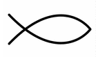

# Appendix 1 - Classification

There are several reasons why classification of the FOL is useful. Categories help us to group objects and determine similarities and differences between objects. Classification increase the resolution of the problem field and explains relationships between objects. Among quantitative and qualitative research methods, categorization and FOL type descriptions are useful methods which all bring additional substance to the study. Classification of the FOL may further clarify the local and the temporal development of motives. Mathematical properties that belong to each group and progressing between groups may give extra insights to the historical development of the motif. Classification helps to discuss about the topic with more detailed and unambiguous terms.

We can distinguish seven classes of which the first two of are the preliminary appearances of the FOL: 1. Vesica Piscis and 2. six-petal rosette. The next three are the main classes: class 1, class 2, and class 3. The sixth class is reserved to indicate any progression of the FOL beyond class 3. Finally, the seventh class is reserved for pattern occurrences of the FOL that are separate from symbol appearances.

1. Vesica Piscis
2. Six petal rosette
3. Class 1
4. Class 2
5. Class 3
6. Class n (n > 3)
7. Class p (p = pattern)

The FOL formation could also have been categorized to two other groups: hexagonal and concave forms. Many of the occurrences of the symbol instead of using curved lines, uses straight lines which creates a hexagonal grid. But I have left this categorization for the future work.

<!-- nopb -->

## Vesica Piscis

{caption=1 width=200}

Two circles of the same size intersect each other at the center of both circles. This is the most fundamental geometrical component of the Flower of Life symbol. Vesica Piscis is sometimes called mandorla, or almond, especially in the Orthodox iconography.

Piscis or a fish  is known to refer to the middle of the symbol that is somewhat similar to a fish shape. The ratio between the radius of the circle and a straight line drawn to the two intersection points is sometimes called "the measure of a fish". This ratio is a square root of 3 or its reciprocal 1/√3. This geometric form is so famous and well known in history and there is so much information available on it that it does not really need any special description in this study.

<!-- endnopb -->

## Six-petal rosette

{caption=1}
{caption=1}
<!-- clear -->

With or without the circle around it, this is one of the most used geometric formation in the ancient art. Rosette is a general name for the symmetrical appearance of the flower-like petals. Petals can be three, four, five, six, or any multiple of these. But when speaking of the FOL, the six-petal rosette is the correct one. The most important aspect of this symbol is the relation between 6 and 7, six leaves and seven intersecting points. Occurrences of the six-petal rosette are too common to be in the scope of this research. Sometimes six-petal rosette and the next class 1 FOL are called a "seed of life" in the contemporary New Age circles.

## Class 1

{caption=1}
{caption=1}
<!-- clear -->

The third category includes the simplest FOL symbol. Occurrences of this class 1 FOL are not as actively collected on my list of artefacts as classes 2 and 3. The criteria for including this symbol in the list of FOL classifications is because the symbol requires additional helper circles and arcs drawn outside the final motif, that are then erased from the final picture. This is a common factor for all classes 1, 2, and 3.

Historical usage of the class 1 FOL together with the lily is one of the most important subject on my interpretation of the FOL symbol. Associating the FOL with death and afterlife is due to the fact that the lily was associated, like it is still common nowadays, with afterlife and death. This connection is further supplemented by one of the oldest artifacts related to the FOL collection, Mycenaean [golden rosettes](http://artifacts.flowerofliferesearch.com/2000-0bc.html#fig6.1.1) (1600 BC) that are presented in my previous research. These gold foil disks were buried with royal people as special "attachments"<!-- cite author="Irene S. Lemos" title="The Protogeometric Aegean: The Archaeology of the Late Eleventh and Tenth Centuries BC" date="2002" location="Page 130" type="book" href="https://books.google.fi/books?redir_esc=y&hl=fi&id=TIk9smxMvzAC&q=attachments#v=snippet&q=attachments&f=false" -->. [Golden goblet](http://artifacts.flowerofliferesearch.com/2000-0bc.html#fig6.1.4) (1400 - 1100 BC) from Marlik is also one of the early class 1 FOL appearances. All goblets in Marlik were found from the royal burial sites. The class 1 motif can be seen on many Roman mosaics, funerary steles, and ossuaries.

Similar to the six-petal rosette, the class 1 FOL is too common to be collected on a small documentation project. Although my central focus is mainly to bring class 2 and 3 artifacts into daylight, cataloging early occurrences of the class 1 FOL artifacts surely helps to reveal crucial knowledge of the origin of the symbol.

In this complementary document, [item 1](newitems.html#item-1), [item 2 a, b, c](newitems.html#item-2-a-b-c), and [item 5](newitems.html#item-5) as a continuous ornament contains the class 1 version of the FOL.

<!-- nopb -->

## Class 2

{caption=1}
{caption=1}
<!-- clear -->

The fourth stage of the FOL symbol is the class 2. The earliest occurrence of this version of the FOL can be found from an Egyptian [cosmetic box](http://artifacts.flowerofliferesearch.com/2000-0bc.html#fig6.1.2) (1500 BC). Other cosmetic boxes from Egypt that originate from the same time period contain also 24-petalled rosettes. All are made with a compass and they were possibly used to store a lotus or corresponding fragrances. Ivory whorls from Cyprus that contain the FOL class 2 are dated roughly to the same period, middle of the second millennium. A silver goblet from Marlik made in 1000 BC has the FOL class 2 depicted on it, and so has the bowl from Levant, 800 BC. Many roman period mosaics use this formation, and so does numerous woodwork from the Common Era. [Items 2 b and c](newitems.html#item-2-a-b-c), [item 3](newitems.html#item-3), [item 4](newitems.html#item-4), [item 6](newitems.html#item-6), and [item 7](newitems.html#item-7) in this complementary document have this symbol attached on them. 

From the samples we have available, it is clear that this form of the FOL is already more difficult to draw than the class 1. A slight miss-position of the compass will accrue and soon the miss-orientation becomes visible for the eye. D. Melchizedek calls this form a "seed of life"<!-- cite author="Drunvalo Melchizedek" title="The ancient Secret of the Flower of Life, vol 1" date="1999" location="Figure 2-21" type="book" href="" -->, but doesn’t give any special name for the FOL class 1.

There are totally 45 circles in the figure 7.7. Number 45 is the 9th pyramidal number: 1+2+3+4+5+6+7+8+9 = 45.

<!-- endnopb -->

<!-- nopb -->

## Class 3

{caption=1}
{caption=1}
<!-- clear -->

According to D. Melchizedek, class 3 is the real and complete FOL. It is not as common as the other classes, and one could argue whether there is any special meaning attached to this particular symbol, or if it just the same motif than classes 1 and 2. This formation brings no new elements compared to classes 1 and 2. But bigger the formation goes, the level of difficulty increases. Early occurrences of this symbol are debatable. The FOL in Abydos still needs examination. The FOL class 3 used as a background model of the Pre-Hittite sun symbol presented in this complementary document is speculative in nature. The first occurrence of the FOL class 3 comes from the Marlik silver goblet dated to 1400 - 1100 BC. Thereafter it appears on the Near East silver beaker from 600 BC. Again, Roman mosaics use the class 3 FOL and so do the wall drawings in Syria (729 AD), which are particularly intriguing. Numerous woodworkers from various countries in the Common Era used this form and have maintained the tradition until our days. [Item 1](newitems.html#item-1) and [item 2 a](newitems.html#item-2-a-b-c) in this complementary document contains the class 3 FOL.

Mathematical properties of the class 3 symbol elements are interesting, especially the number of circles that is needed to construct the symbol, i.e. 19 for the figure 7.8 and 55 for the figure 7.9. Number 55 is the tenth number (greater than 0) in the triangular number sequence called pyramidal number: 1+2+3+4+5+6+7+8+9+10 = 55. Number 55 is also the tenth Fibonacci number greater than 0: 11, 12, 23, 34, 55, 86, 137, 218, 349, 5510,... It is the largest Fibonacci number that is also a triangular number.

Intersections point count is 37 for the figure 7.8 and 73 for the figure 7.9. 37 and 73 are mirror numbers. 73 is the 21st prime number. 37 is the 12th prime number. 21 and 12 are again mirror numbers, and further 21 is 3\*7 or 7\*3, so we can speak of nested recursive mirror number sequence. Other curiosity is that the "Plato's lambda" (1,2,4,8 + 1,3,9,27) adds up to 55.

<!-- endnopb -->

#### Mathematical properties and options for classes 1, 2, and 3

Classes 1, 2, and 3 are central variations of the FOL form at I want to spend more time to analyze. Each of the classes has mathematical properties and options that can be calculated in the following manner:

##### Mathematical properties

1. Number of *circles* that are needed to construct the symbol
2. Number of intersection *points* that are present in the construction
3. Number of *leaves* that are present in the construction
4. Minimum (*w_min*) and maximum (*w_max*) width of the symbol 
5. Number of concave *triangles* that are countable within the construction

Each of them can be calculated from inner and outer part of the construction giving two options:

<ol style="list-style-type: lower-alpha;">
<li>Inside the formation</li>
<li>Inside + outside the formation combined</li>
</ol>

Circles that are totally inside the formation is a bit arbitrary because the FOL needs to have partial circles / arcs to be fully formed as a symbol. In this case, one should pay attention to the option b, i.e. the combined value of the inside and outside objects.

The count of leaves is a bit arbitrary in the option b because there are half-formatted leaves on the outer part of the motif. As a result, only fully formed leaves are counted in the option b.

Width of the motif has two values because of the hexagonal shape of the FOL which has two different diagonals. Longer (max.) diagonal value is the vertex of the hexagon. Shorter (min.) diagonal value related to the square root 3 is the apothem of the hexagon.

Concave triangles inside the FOL are countable in an exact number, but on the outer formation, we can see partly formed concave triangles and only fully symmetrical triangles are counted in the option b.

|class|option|circles|points|leaves|w_min|w_max|triangles|
| --- | ---- | ----- | ---- | ---- | --- | --- | ------- |
|1|a|1 |7 |12 |1    |1    |6 |
|1|b|13|19|18 |2    |2.732|24|
|2|a|7 |19|42 |1.732|2    |24|
|2|b|45|37|60 |3    |3.464|60|
|3|a|19|37|90 |2.598|3    |54|
|3|b|55|73|120|4    |4.330|96|

## Class n

There is practically no limit on how many layers of circles you can draw on the FOL motif. However, just few artifacts have more layers than class 3 formation of the FOL. [The Idalion cup](http://artifacts.flowerofliferesearch.com/2000-0bc.html#fig6.1.6) has a class 5 FOL and actually the "fruit of life" symbol presented by D. Melchizedek would fit inside the Idalion cup formation. [The bronze vessel](http://artifacts.flowerofliferesearch.com/2000-0bc.html#fig6.1.7) from Nimrud has an extraordinary big formation, a class 8 FOL.

## Class p

{caption=1 width=300 style="border: 1px solid #aaa"}

The class p means a pattern-like or an ornament-like formation of the FOL. This is quite typical among the previous classes. [Item 5](newitems.html#item-5) and [item 8](newitems.html#item-8) in this book belong to this category. Pre-Indus ceramic ornament (2500 BC) is the earliest reference of the FOL in class p. From 800 - 600 BC on, many items like the Ivory tusk, the plaque, and the cosmetic pyxis from Nimrud, Terracotta torsos from Cyprus, and stone floor sills from Iraq, all belong to the class p FOL category. The church pavement from London (1600 AD) uses this formation. One undated Assyrian wall decoration is also within the class p FOL categorization.

One notable feature difference between the Cownose and the Flower of Life is that the Cownose pattern is almost without exceptions found in an ornament / pattern form. It is clearly not used in a similar way than the FOL is used in classes 1, 2, and 3, where the symbol is enclosed by a circular form around it.


