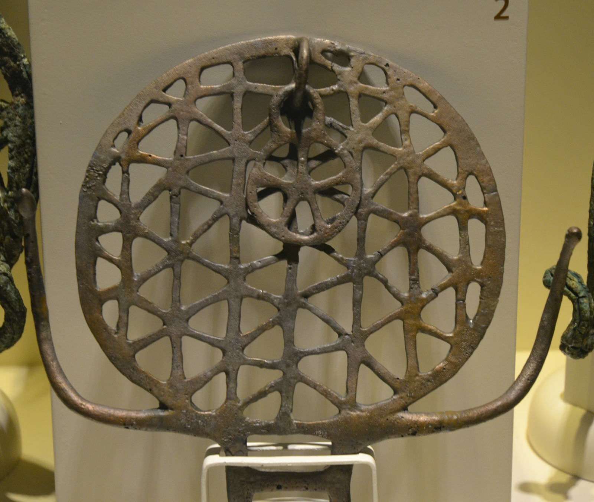
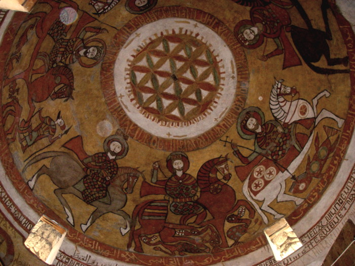
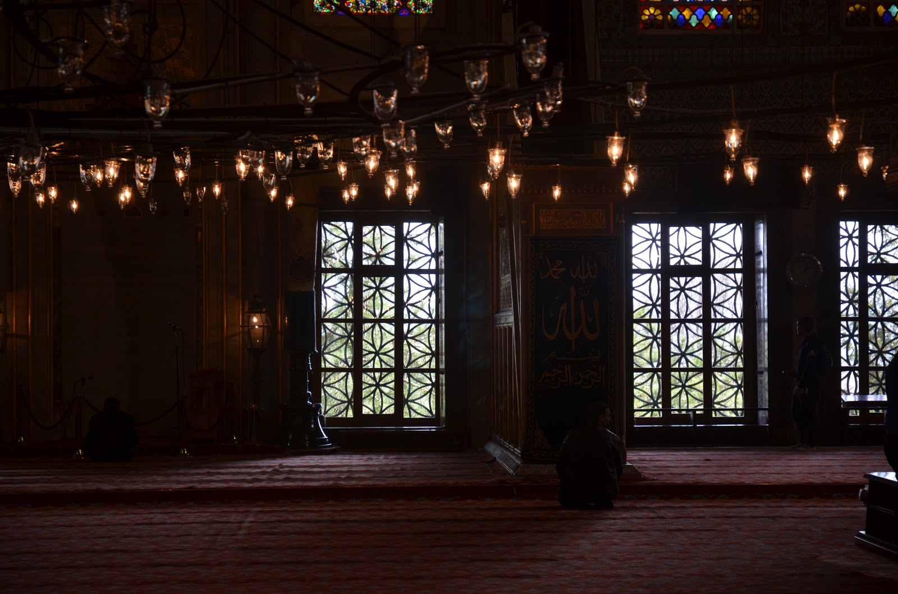
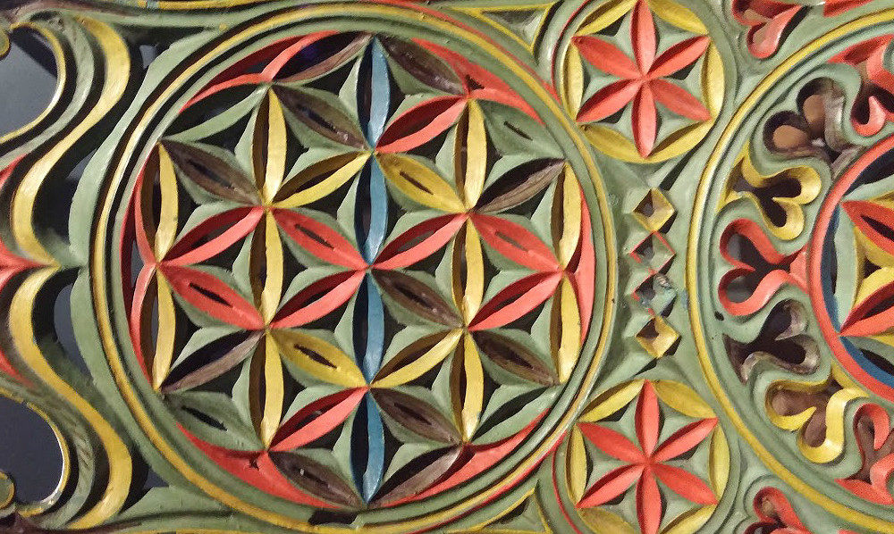
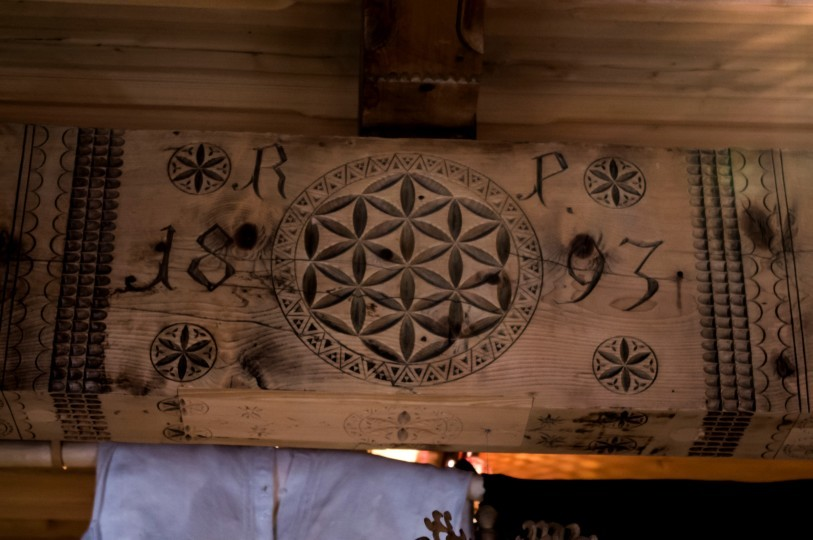

<!-- pagewrapper -->
# Appendix 2 - Occurrences of the FOL

Faded pictures represents links to copyright protected images, which needs to be obtained from the original source.

### 2000 BC - 0 AD

| ***Item*** | ***Class*** | ***Location*** | ***Date*** | ***Thumbnail*** |
| -- | -- | -- | -- | -- |
|[Pre-Indus ornament](part1/planeflower.md#oldest-reference-of-the-fol-pattern-so-far)|class p|India|2500 BC+||
|[Pre-Hittite Sun](part2/xxx.md#hittite-sun-discs)|class 3|Alacahöyük, Turkey|2500||
|[Gold foils](http://artifacts.flowerofliferesearch.com/2000-0bc.html#fig6.1.1)|class 1|Mycenae, Greece|1600 BC||
|[Wooden cosmetic boxes](http://artifacts.flowerofliferesearch.com/2000-0bc.html#fig6.1.2)|class 2|Thebes, Egypt|1492 - 1473 BC||
|[Silver goblet](http://artifacts.flowerofliferesearch.com/2000-0bc.html#fig6.1.3)|class 1|Iran|1400 - 1100 BC||
|[Silver gazelle cup](http://artifacts.flowerofliferesearch.com/2000-0bc.html#silver-gazelle-cup)|class 1|Iran|1000 BC||
|[Gold and silver goblets](http://artifacts.flowerofliferesearch.com/2000-0bc.html#fig6.1.4)|class 1, 2, 3|Marlik, Northern Iran|1400 – 1100 BC||
|[Ivory whorls](http://artifacts.flowerofliferesearch.com/2000-0bc.html#fig6.1.5)|class 2|Cyprus|1600 - 1100 BC||
|[Bronze bowl](http://artifacts.flowerofliferesearch.com/2000-0bc.html#phoenician-bronze-bowl)|class 1|Levant|850 BC||
|[Idalion cup](http://artifacts.flowerofliferesearch.com/2000-0bc.html#fig6.1.6)|class n|Cyprus|800 – 700 BC||
|[Oval pyxis](http://artifacts.flowerofliferesearch.com/2000-0bc.html#oval-pyxis)|class p|Nimrud|800 – 700 BC||
|[Terracotta torsos](http://artifacts.flowerofliferesearch.com/2000-0bc.html#terracotta-torso)|class p|Greece & Cyprus|700 BC||
|[Ivory tusk](http://artifacts.flowerofliferesearch.com/2000-0bc.html#ivory-tusk)|class p|Nimrud|800 - 700 BC||
|[Ivory plaque](http://artifacts.flowerofliferesearch.com/2000-0bc.html#ivory-plague)|class p|Nimrud|800 - 700 BC||
|[Bronze vessel](http://artifacts.flowerofliferesearch.com/2000-0bc.html#fig6.1.7)|class n|Nimrud|700 BC||
|[Stone floor sills](http://artifacts.flowerofliferesearch.com/2000-0bc.html#fig6.1.8)|class p|Northern Iraq|645 BC||
|[Silver beaker](http://artifacts.flowerofliferesearch.com/2000-0bc.html#fig6.1.9)|class 3|Near East|600 – 500 BC||
|[Cave arches](http://artifacts.flowerofliferesearch.com/2000-0bc.html#fig6.1.10)|class p|Maharashtra, India|200 – 100 BC||
|[Opus signinum](http://artifacts.flowerofliferesearch.com/2000-0bc.html#opus-signinum)|class 2|Caminreal, Spain|200 - 100 BC||
|[Floor mosaic](http://artifacts.flowerofliferesearch.com/2000-0bc.html#fig6.1.11)|class 3|Ephesus, Turkey|100 BC||
|[Floor mosaic](http://artifacts.flowerofliferesearch.com/2000-0bc.html#fig6.1.12)|class 2|Cyprus|75 – 50 BC||
|[Floor mosaic](http://artifacts.flowerofliferesearch.com/2000-0bc.html#fig6.1.13)|class 2|Israel|20 BC||

### 0 AD - 2000 AD

| ***Item*** | ***Class*** | ***Location*** | ***Date*** | ***Thumbnail*** |
| -- | -- | -- | -- | -- |
|[Floor mosaic](http://artifacts.flowerofliferesearch.com/0-2000ad.html#mosaic-floor-in-pompeii)|class 2|Pompeii, Italy|100 BC - 200 AD||
|[Floor mosaic](http://artifacts.flowerofliferesearch.com/0-2000ad.html#fig6.2.1)|class 2|Masada, Israel|30 BC – 70 AD||
|[Floor mosaic](http://artifacts.flowerofliferesearch.com/0-2000ad.html#fig6.2.2)|class 1, 2|Seville, Spain|100 AD||
|[Temple stele](http://artifacts.flowerofliferesearch.com/0-2000ad.html#fig6.2.3)|class 2|Córdoba, Spain|100 - 500 AD||
|[Floor mosaics](http://artifacts.flowerofliferesearch.com/0-2000ad.html#fig6.2.4)|class 3|Besancon, France|123 BC – 486 AD||
|[Floor mosaic](http://artifacts.flowerofliferesearch.com/0-2000ad.html#fig6.2.6)|class 2|Kabile, Bulgaria|400 AD||
|[Silver bowl](http://artifacts.flowerofliferesearch.com/0-2000ad.html#sassanian-bowl)|class 2/p|Near East|400 – 500 AD||
|[Wall paintings](http://artifacts.flowerofliferesearch.com/0-2000ad.html#wall-in-syria)|class 2, 3, p|Qasr al-Hair ash-Sharqi, Syria|729 AD||
|[Church pavement](http://artifacts.flowerofliferesearch.com/0-2000ad.html#fig6.2.7)|class p|London, England|1268 AD||
|[Byzantine ruin](http://artifacts.flowerofliferesearch.com/0-2000ad.html#fig6.2.8)|class p|Deir Seta, Syria|1400 AD||
|[Hampi pillar](http://artifacts.flowerofliferesearch.com/0-2000ad.html#fig6.2.9)|class p|India|1400 AD||
|[Ottoman cemetery decorations](http://artifacts.flowerofliferesearch.com/0-2000ad.html#fig6.2.10)|class 2/p|Izmir, Turkey|1400 AD||
|[Castle of Rozmberk](http://artifacts.flowerofliferesearch.com/0-2000ad.html#fig6.2.12)|class 2/p|Czech Republic|1400 - 1600 AD||
|[Codex Atlanticus folio 307v](http://artifacts.flowerofliferesearch.com/0-2000ad.html#fig6.2.13)|class 1, 2, 3, n, p|Italy|1500 AD||
|[Stone inscriptions](http://artifacts.flowerofliferesearch.com/0-2000ad.html#fig6.2.14)|class 2, p|Bulgaria|1600 AD||
|[Coptic church cupola](newitems.md#item-4)|class 2|Thebe, Egypt|1600 AD||
|[Mosque window background](newitems.md#item-8)|class p|Istanbul, Turkey|1616 AD||
|[Distaff blades](newitems.md#item-2-a-b-c)|class 1, 2, 3, n, p|Finland|1700 - 1900 AD||
|[Woodcarvings](newitems.md#item-7-a-b-c)|class 1, 2, 3, n, p|Zakopane, Poland|1800 AD||

### Undated

| ***Item*** | ***Class*** | ***Location*** | ***Date*** | ***Thumbnail*** |
| -- | -- | -- | -- | -- |
|[Abydos wall](http://artifacts.flowerofliferesearch.com/undated.html#fig6.3.1)|class 2, 3, p|Abydos, Egypt|BC, AD||
|[Assyrian wall decoration](http://artifacts.flowerofliferesearch.com/undated.html#fig6.3.2)|class p|Near East|BC||
|[Chapel lunette](http://artifacts.flowerofliferesearch.com/undated.html#fig6.3.4)|class 1, 2, p|Patmos, Greece|AD||
|[Fu Dog sphere](http://artifacts.flowerofliferesearch.com/undated.html#fig6.3.6)|class p, 3d|Shanghai, China|AD||
|[Giant urn](http://artifacts.flowerofliferesearch.com/undated.html#giant-urn)|class p, 3d|Beijing, China|AD||
|[Marble floor decoration](http://artifacts.flowerofliferesearch.com/undated.html#fig6.3.7)|class 3|Amritsar, India|AD||
|[Jewish painting](http://artifacts.flowerofliferesearch.com/undated.html#fig6.3.8)|class 2|-|AD||
<!-- endpagewrapper -->
